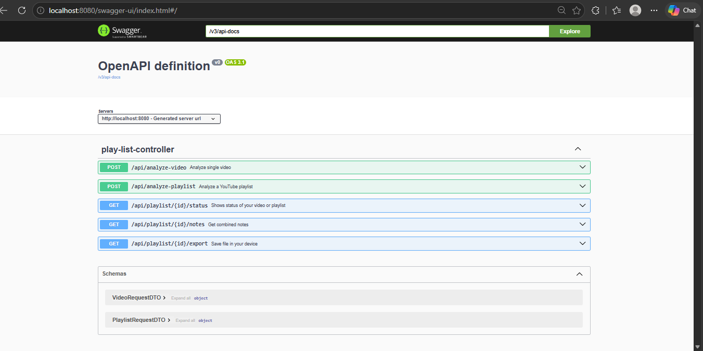
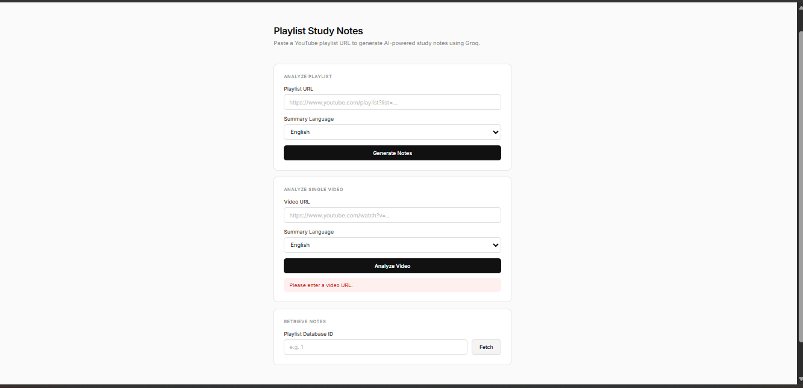

<<<<<<< HEAD
# AI Playlist Study System

> Paste any YouTube playlist URL and get AI-generated study notes instantly — powered by Groq LLM, Spring Boot, and Flask.

Built by **Dhruv Thakker** · GEC Rajkot · AI & Data Science · Pre-Final Year

---

## What It Does

- Accepts a YouTube playlist URL
- Fetches video transcripts automatically
- Summarizes each video using **Groq (llama-3.3-70b-versatile)**
- Combines all summaries into structured study notes
- Exports notes as **PDF or Markdown**
- Supports single video analysis too

---

## System Architecture

```
User → Spring Boot (8080) → YouTube Data API v3
                          → Flask Transcript Service (5000) → youtube-transcript-api
                          → Groq API (llama-3.3-70b-versatile)
                          → MySQL Database
```

---

## Tech Stack

| Layer | Technology |
|-------|-----------|
| Backend | Java 17 + Spring Boot 4.0.6 |
| AI Summarization | Groq API — llama-3.3-70b-versatile |
| Transcript Service | Python 3 + Flask + youtube-transcript-api |
| Database | MySQL 8.x + Spring Data JPA + Hibernate |
| API Docs | SpringDoc OpenAPI (Swagger UI) |
| Frontend | HTML5 + CSS3 + Vanilla JS |
| HTTP Client | Spring WebFlux WebClient |
| PDF Export | iText 5 |

---

## API Endpoints

| Method | Endpoint | Description |
|--------|----------|-------------|
| POST | `/api/analyze-playlist` | Submit YouTube playlist URL for processing |
| POST | `/api/analyze-video` | Submit single YouTube video URL |
| GET | `/api/playlist/{id}/status` | Poll processing status (PENDING / IN_PROGRESS / DONE) |
| GET | `/api/playlist/{id}/notes` | Get combined AI study notes |
| GET | `/api/playlist/{id}/export?format=pdf` | Download notes as PDF |
| GET | `/api/playlist/{id}/export?format=md` | Download notes as Markdown |

Full interactive docs available at `http://localhost:8080/swagger-ui/index.html`

---

## Screenshots

### Swagger UI — All Endpoints


### Frontend UI


### PDF Export via Postman


---

## Local Setup

### Prerequisites
- Java 17+
- Python 3.10+
- MySQL 8.x
- Groq API key — [console.groq.com](https://console.groq.com)
- YouTube Data API v3 key — [Google Cloud Console](https://console.cloud.google.com)

### 1. Clone the repository
```bash
git clone https://github.com/dhruvthakker21/ai-study-system.git
cd ai-study-system
```

### 2. Set up MySQL
```sql
CREATE DATABASE ai_study_db;
```

### 3. Configure environment variables
Set these in your system environment variables:
```
youtube_api_key=your_youtube_api_key
groq_api=your_groq_api_key
```

### 4. Configure `application.properties`
```properties
spring.datasource.url=jdbc:mysql://localhost:3306/ai_study_db
spring.datasource.username=root
spring.datasource.password=your_password
youtube.api.key=${youtube_api_key}
groq.api.key=${groq_api}
ai.service.url=http://localhost:5000
```

### 5. Start Flask transcript service
```bash
cd flask-service
pip install flask youtube-transcript-api
python app.py
```

### 6. Start Spring Boot
```bash
./mvnw spring-boot:run
```

### 7. Open the app
```
http://localhost:8080
```

---

## API Usage Examples

### Analyze a playlist
```bash
curl -X POST http://localhost:8080/api/analyze-playlist \
  -H "Content-Type: application/json" \
  -d '{"playlistUrl": "https://www.youtube.com/playlist?list=YOUR_PLAYLIST_ID", "language": "English"}'
```

### Get combined notes
```bash
curl http://localhost:8080/api/playlist/1/notes
```

### Check processing status
```bash
curl http://localhost:8080/api/playlist/1/status
```

### Export as PDF
```bash
curl http://localhost:8080/api/playlist/1/export?format=pdf --output notes.pdf
```

### Analyze single video
```bash
curl -X POST http://localhost:8080/api/analyze-video \
  -H "Content-Type: application/json" \
  -d '{"videoUrl": "https://www.youtube.com/watch?v=VIDEO_ID", "language": "English"}'
```

---

## Database Schema

```sql
playlist  (id, playlistId, title, channelTitle, videoCount, status, createdAt)
video     (id, videoId, playlistId FK, title, description, transcriptText, status, createdAt)
summary   (id, videoId FK, summaryText, createdAt)
playlist_notes (id, playlistId FK, combinedNotes, createdAt)
```

---

## Known Limitations

- YouTube may temporarily block IPs after heavy testing — wait 24hrs or use a different network
- Groq rate limit: 12,000 TPM — 5 second delay between videos is applied automatically
- Videos without captions will fail transcript fetch gracefully

---

## Future Improvements

- Separate `VideoService` for single video analysis (Single Responsibility Principle)
- Async processing with `@Async` + `CompletableFuture`
- Docker Compose for one-command local setup
- Cloud deployment on Railway/Render
- User authentication and personal note history

---

## Project Structure

```
src/main/java/com/dhruvthakker/ai_study_system/
├── controller/        # REST controllers
├── services/          # Business logic
├── model/             # JPA entities
├── repository/        # Spring Data repositories
├── DataTransferObject/ # Request/Response DTOs
├── config/            # WebClient config
└── Exception/         # Global exception handler

src/main/resources/
└── static/index.html  # Frontend UI
```

---

## Connect

**Dhruv Thakker** · [GitHub](https://github.com/dhruvthakker21) · GEC Rajkot · AI & Data Science
=======
# ai-study-system
This is ai system that gives you summary when you enter youtube url 
>>>>>>> 9480c88d58bff2179525cec6d118955f1bbf6162
